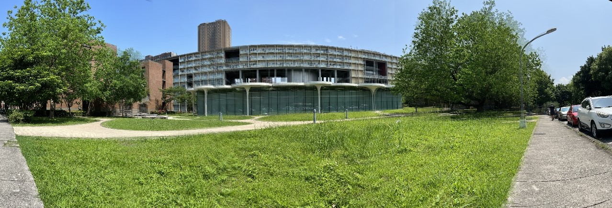

# project 2 - image stitching

Usage

1. -log info | debug : set logging level
2. -p path
3. -f focal_legnth
4. -o output_dir
5. -m : output matching example
6. -r : Descending image number from left to right.
7. -s n: Scale down n times during computing.

example:

`
python3 main.py -s 4 -p data/ -o output -f 1200
`

