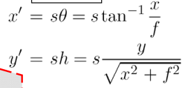
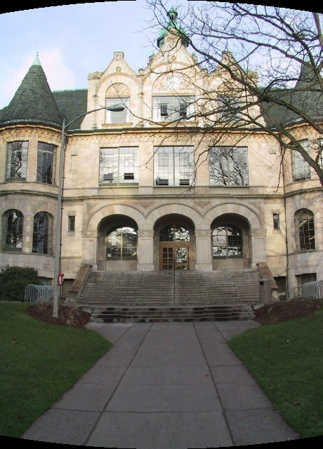
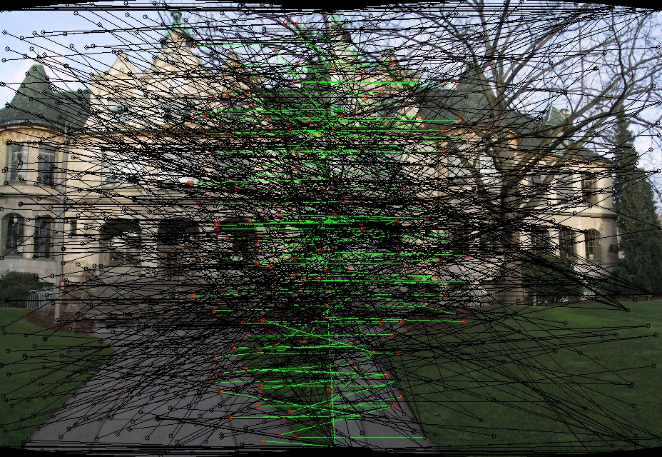
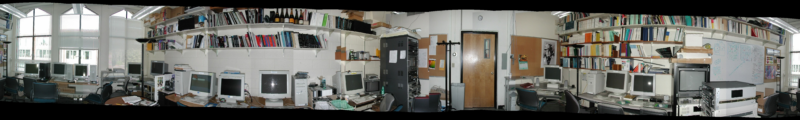
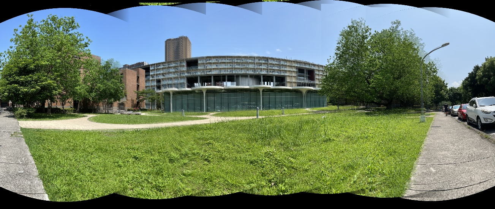
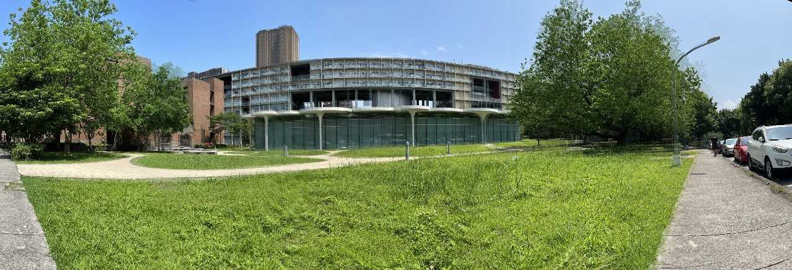

# Project 2 - Image stitching

# 1. Cylindrical Projection

Project images to Cylindrical space.

Formula: 

x’ and y’ are the shift to the center of the image.



Example:

focal length is calculated with auto stitch.



# 2. MSOP

Ref:

[](http://matthewalunbrown.com/papers/cvpr05.pdf)

1. Calculate blurred gradient maps for several scaling levels.
2. Calculate the harris corner detection function value.
    
    
    
    corner detection function :
    


1. Find local maxima of corner detection function in every 3*3 grid.
2. Nonmaximal suppression to select key points. This method picks one key point in every circle of radius r, so we can have key points across whole images.
3. Subpixel refinement. This method calculates where the real maxima should be by Taylor expansion and we change the position of maxima.
4. Calculate orientation. Orientation is used in obtaining descriptors.
Formula:


5. Get descriptors of each key point. Sample an 8\*8 patch from the 40*40 grid around the key point. Rotate the patch according to orientation. The patch is the descriptor.

# 3. Matching

Brute force search matches in features given by the MSOP algorithm.

Additionally, we discard a match if the distance of the pair is too large, and we sort the matches by similarity and take the best n matches. (n: best 1/4 ~1/5). This can remove most of outliers.

(black are matched discarded , green are matches used eventually)

This image can be generates by -m option.



## Ransac

We use the Ransac algorithm to determine the transformation of two images.

The transformation we assumed is translation.

Randomly pick a match, determine the transformation, and count the inlier (threshold).

Find the transformation that has the most inlier.

## Blending

We do weighted blending. The weight is determined by the distance between two blending images. 

## Cropping

Crop the image to make the panorama rectangle. We did not program this function but crop it with other tools (windows photo viewer).


# example:





# Result - ours

```bash
python3 main.py -s 4 -p data/ -o output -f 1200
```




